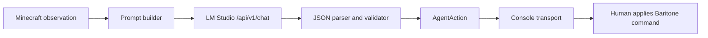

# llm-playing-minecraft

`llm-playing-minecraft` is an early-stage Minecraft agent runtime. The goal is
to let a local LLM plan safe, supervised Baritone actions for a Minecraft client
running Fabric and Baritone, with the LLM served by LM Studio.

The project is designed around:

- LM Studio's native local `http://localhost:1234/api/v1` API
- an explicit API key passed as `Authorization: Bearer ...`
- the locally loaded LM Studio model id `google/gemma-4-e4b`
- a 16,384-token active context window
- a built-in `bold` Baritone profile for sprinting, parkour, water-bucket falls,
  and more human-like risk/reward
- a small, auditable action schema before direct Minecraft control is added
- documentation-first development so every bridge is understandable and testable

## Current Status

This first slice is a runnable planning program. It calls LM Studio, asks the
model for one JSON action, validates that action, and prints a supervised
Baritone command for a human operator.

Direct Minecraft injection is intentionally not hidden behind magic. Baritone is
a client-side mod, so a normal server RCON connection cannot directly run
`#mine`, `#goto`, or other client chat commands inside the player client. The
current `console` transport is the safe base layer; future transports can target
a Fabric chat bridge, macro bridge, or bot client once that bridge exists.

## Quick Start

### 1. Start LM Studio

Install LM Studio, download or load a Gemma-compatible model, and start the local
server. This project targets the native LM Studio endpoint shown by the app and
the user's curl example:

```text
http://localhost:1234/api/v1/chat
```

This repository defaults to:

```text
MINECRAFT_LLM_MODEL=google/gemma-4-e4b
MINECRAFT_LLM_CONTEXT_LENGTH=16384
```

If LM Studio reports a different local model id for your loaded quantization,
use that exact id in `.env`.

### 2. Configure the agent

Copy the example environment file:

```powershell
Copy-Item .env.example .env
```

Edit `.env` if needed:

```env
MINECRAFT_LLM_BASE_URL=http://localhost:1234/api/v1
MINECRAFT_LLM_API_KEY=lm-studio-local-development-key
MINECRAFT_LLM_MODEL=google/gemma-4-e4b
MINECRAFT_LLM_CONTEXT_LENGTH=16384
MINECRAFT_BARITONE_PROFILE=bold
```

LM Studio may not validate the local key, but this program always requires and
sends one so the runtime contract stays compatible with OpenAI-style APIs.

### 3. Run a health check

From the repository root:

```powershell
python -m llm_playing_minecraft doctor
```

If you installed the package in editable mode, the console script is also
available:

```powershell
llm-playing-minecraft doctor
```

### 4. Ask for one Minecraft action

```powershell
python -m llm_playing_minecraft plan `
  --goal "Collect enough wood to craft a pickaxe" `
  --observation "Player is in a plains biome near oak trees. Inventory is empty."
```

Expected shape:

```json
{
  "baritone_command": "#mine oak_log",
  "chat": null,
  "done": false,
  "reason": "Wood is needed before crafting basic tools.",
  "wait_seconds": 3
}
```

### 5. Run a supervised loop

```powershell
python -m llm_playing_minecraft run `
  --goal "Collect stone tools, food, and shelter before night" `
  --interactive-observation `
  --steps 5
```

Paste fresh observations from Minecraft between steps. The agent will print the
validated chat and Baritone command for the operator to apply.

### 6. Print the bold Baritone profile

```powershell
python -m llm_playing_minecraft baritone-profile --no-comments
```

Paste the printed `#set ...` commands into a Baritone-enabled client to make the
bot less timid: sprinting, parkour, diagonal descents, block placement, water
bucket falls, and small fall-damage shortcuts are enabled.

## CLI Commands

```text
doctor    Check configuration and confirm LM Studio is reachable.
models    Print model ids reported by the configured API.
baritone-profile
          Print the configured Baritone #set profile.
plan      Ask the LLM for exactly one validated action.
run       Execute a supervised observe-plan-act loop with console output.
```

## Configuration

| Variable | Default | Purpose |
| --- | --- | --- |
| `MINECRAFT_LLM_BASE_URL` | `http://localhost:1234/api/v1` | LM Studio native API base URL. |
| `MINECRAFT_LLM_API_KEY` | none | Required API key sent as a Bearer token. |
| `MINECRAFT_LLM_MODEL` | `google/gemma-4-e4b` | Model id sent to `/chat`. |
| `MINECRAFT_LLM_CONTEXT_LENGTH` | `16384` | Active planner context window. |
| `MINECRAFT_LLM_TEMPERATURE` | `0.2` | Low by default for predictable actions. |
| `MINECRAFT_LLM_TIMEOUT_SECONDS` | `60` | HTTP timeout for local inference. |
| `MINECRAFT_BARITONE_PROFILE` | `bold` | Baritone settings profile referenced by the planner. |

See [docs/configuration.md](docs/configuration.md) for aliases and operational
details.

## Architecture



The important design rule is that the LLM never gets a raw execution channel.
It proposes a small JSON object, the program validates that object, and only
then does a transport receive the action.

Gemma 4 can emit a separate `reasoning` item through LM Studio's native API.
The client ignores that reasoning item and validates only the final `message`
content.

Read more in [docs/architecture.md](docs/architecture.md).

## Baritone Command Contract

Only a small allowlist is accepted right now:

```text
#build #explore #farm #follow #goto #mine #path #pause #resume #set #stop
```

Anything else becomes a conservative `#stop` fallback. Slash commands are
rejected because they can target server administration or non-Baritone behavior.

The built-in `bold` Baritone profile can be printed with:

```powershell
python -m llm_playing_minecraft baritone-profile
```

## Development

Run tests with Python 3.10 or newer:

```powershell
$env:PYTHONPATH="src"
python -m unittest discover -s tests
```

The package has no runtime dependencies beyond Python's standard library.

## Documentation Index

- [docs/architecture.md](docs/architecture.md) explains the runtime layers.
- [docs/configuration.md](docs/configuration.md) lists every environment option.
- [docs/lmstudio-gemma4.md](docs/lmstudio-gemma4.md) walks through LM Studio and Gemma setup.
- [docs/baritone-integration.md](docs/baritone-integration.md) explains the Minecraft bridge plan.
- [docs/baritone-bold-profile.md](docs/baritone-bold-profile.md) documents the aggressive Baritone settings profile.
- [docs/agent-strategy.md](docs/agent-strategy.md) explains how the LLM should use Baritone over long goals.
- [docs/observation-contract.md](docs/observation-contract.md) defines the compact non-image world summary format.
- [docs/prompt-contract.md](docs/prompt-contract.md) documents the model JSON schema.
- [docs/development.md](docs/development.md) covers local development and tests.

## Roadmap

1. Add a real compact observation bridge from Minecraft logs, Baritone state, or
   a Fabric sidecar mod, without screenshots or raw block-radius dumps.
2. Add a dedicated Minecraft client transport that can send chat text to the
   Baritone-enabled player under operator control.
3. Add persistent memory for long-term goals, inventory facts, base locations,
   and agent-to-agent chat.
4. Add integration tests with mocked LM Studio responses and recorded Minecraft
   observations.
5. Support richer planning modes such as "survive the first night", "gather
   diamonds", "build a structure", and "coordinate with another agent".

## References

- [google/gemma-4-E4B-it on Hugging Face](https://huggingface.co/google/gemma-4-E4B-it)
- [LM Studio OpenAI compatibility docs](https://lmstudio.ai/docs/developer/openai-compat/)
