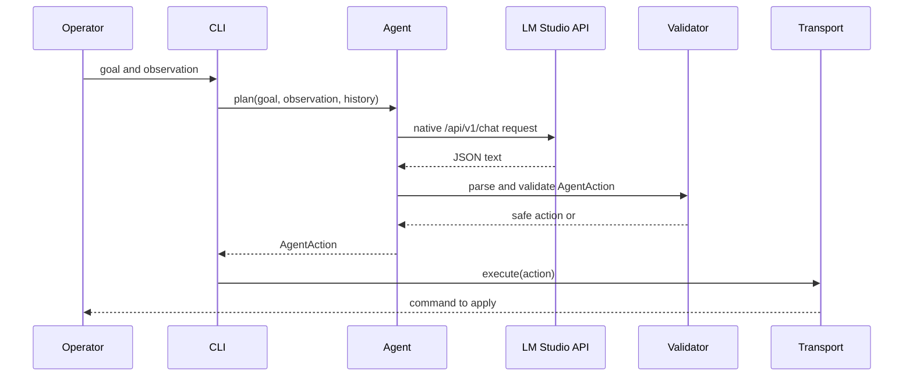

# Architecture

The project is intentionally split into narrow layers. Each layer has one job,
and each boundary is easy to test.

## Runtime Loop



## Components

| Component | File | Responsibility |
| --- | --- | --- |
| Configuration | `src/llm_playing_minecraft/config.py` | Loads `.env` and environment variables. Requires an API key. |
| LM Studio client | `src/llm_playing_minecraft/lmstudio_client.py` | Sends raw HTTP requests to LM Studio's native local endpoints. |
| Prompt builder | `src/llm_playing_minecraft/prompts.py` | Builds the system and user messages for one planning step. |
| Action schema | `src/llm_playing_minecraft/schema.py` | Parses, validates, and renders model actions. |
| Agent loop | `src/llm_playing_minecraft/agent.py` | Coordinates prompt, model call, and validation. |
| Transports | `src/llm_playing_minecraft/transports.py` | Receives validated actions. The first transport prints to console. |
| CLI | `src/llm_playing_minecraft/cli.py` | Exposes `doctor`, `models`, `plan`, and `run`. |

## Why Start With Console Transport?

Baritone commands are client-side chat commands. A Minecraft server command
interface such as RCON can administer a server, but it cannot directly make a
local Fabric client type `#mine iron_ore` into chat.

The console transport keeps the first version honest:

- the LLM can be tested today
- command validation can harden before automation
- the human operator stays in the loop
- future direct-control transports have a stable interface to implement

## Action Lifecycle

1. The operator gives the program a goal and an observation.
2. The prompt asks for exactly one JSON object.
3. The client sends the request to LM Studio.
4. The client ignores native `reasoning` output and keeps the final `message`.
5. The parser extracts JSON even if the model wraps it in a code fence.
6. The validator rejects non-Baritone commands, slash commands, long commands,
   unsupported `#` commands, and malformed fields.
7. If validation fails, the agent emits `#stop`.
8. The transport receives only the validated `AgentAction`.

## Context Window

The runtime is designed around the currently loaded LM Studio context length of
16,384 tokens. The prompt builder uses this value as an approximate budget and
truncates oversized goals or observations before sending them to the model.
This is not a tokenizer-perfect count, but it keeps long Minecraft observations
from overflowing the active context window.

## Extension Points

Add new transports by implementing the `CommandTransport` protocol:

```python
class CommandTransport(Protocol):
    def execute(self, action: AgentAction) -> str:
        ...
```

Likely future transports:

- Fabric sidecar chat bridge
- local macro bridge
- bot-client bridge
- file/socket bridge consumed by another Minecraft process

Observation collection should be added as a separate boundary rather than mixed
into transport code. A good future shape is:

```text
ObservationSource -> MinecraftAgent -> CommandTransport
```
